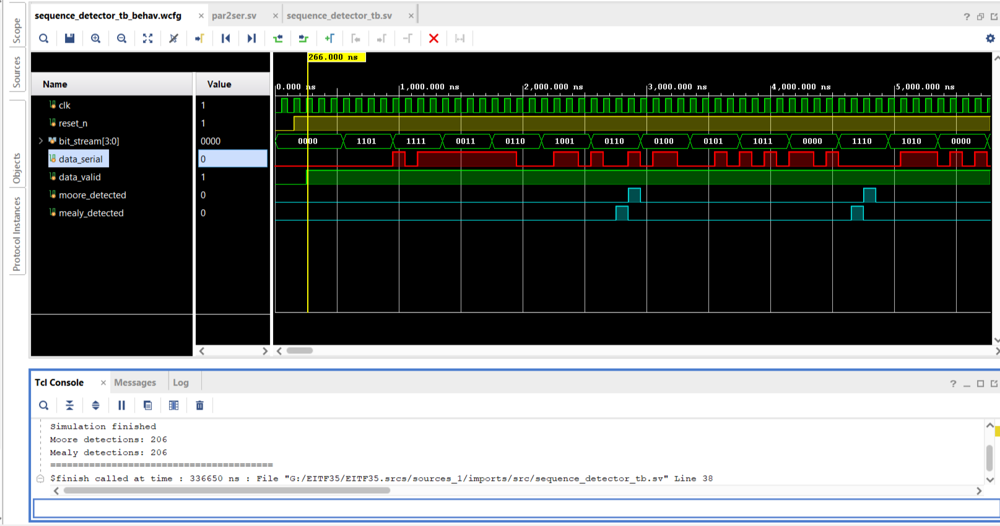

# EITF35 - Introduction to Structured VLSI Design
Under Lund University

## Course content

The course consists of the following four main parts: 1) Design flow based on modern design tools, 2) Use of System Verilog or VHDL as design language and input for logic synthesis, 3) Design of synchronous systems by developing clock cycle true models, 4) Use of field programmable gate arrays (FPGA) for rapid prototyping.

The course contains lectures and projects (including preparations). The projects are design oriented and based on the use of tools for simulation, synthesis, and optimisation with FPGA as the target technology.

More details here: https://kurser.lth.se/lot/course-syllabus-en/25_26/EITF35

## Results
### Lab 1: Sequence detector Finite State Machine
Detect the sequence of '0100', including sequence in sequence. By right it should get 206 occurrences.

### Lab 2: Keyboard controller
In progress