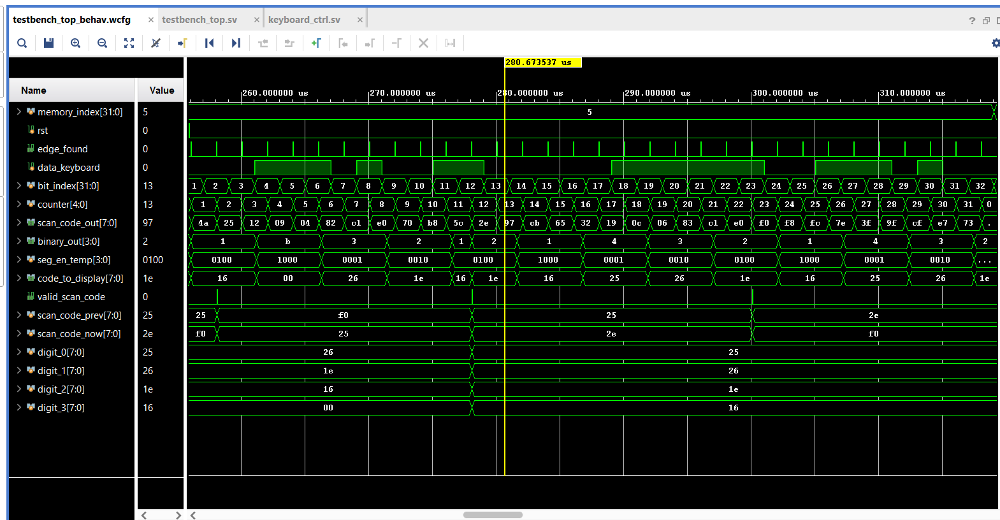

# EITF35 - Introduction to Structured VLSI Design
Under Lund University

The course involves SystemVerilog as a Hardware Description Language (HDL), which is used for prototyping on an Artix-7 FPGA board. Xilinx Vivado is utilized for testbench simulations and hardware syntheses.

## Course content

The course consists of the following four main parts: 1) Design flow based on modern design tools, 2) Use of System Verilog or VHDL as design language and input for logic synthesis, 3) Design of synchronous systems by developing clock cycle true models, 4) Use of field programmable gate arrays (FPGA) for rapid prototyping.

The course contains lectures and projects (including preparations). The projects are design oriented and based on the use of tools for simulation, synthesis, and optimisation with FPGA as the target technology.

More details here: https://kurser.lth.se/lot/course-syllabus-en/25_26/EITF35

## Results
### Lab 1: Sequence detector Finite State Machine (FSM)
Detect the sequence of '0100', including sequence in sequence. By right it should get 206 occurrences. The project is completed using Vivado built-in simulator. Both Mealy and Moore machine are tested.

### Lab 2: Keyboard controller
Prototyping a keyboard controller using an Artix-7 FPGA board. The keyboard is connected using PS/2 interface. At the end, the FPGA board should detect scan code from the keyboard and display corresponding digits (or letter E, if it's not a digit) to a 4-digit 7-segment display.

Here is the simulated waveforms in Vivado:

The physical implementation will take place soon.